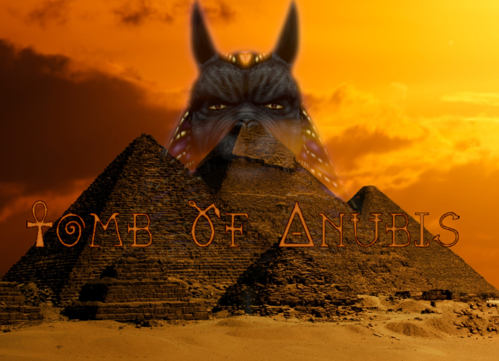

# THE PROJECT CAN BE FOUND UNDER: https://gitlab.inf.ethz.ch/OU-GTC/gamelab/gamelab2023-winterhold-team1

# Project build instructions
Clone the project and open the solution with visual studio. Right click on Solution 'TombOfAnubis' and click Build solution.

# Release

`dotnet publish -c Release -r win-x64 /p:PublishReadyToRun=false /p:TieredCompilation=false --self-contained`

The build can be found under \src\TombOfAnubis\bin\Release\net6.0\win-x64\publish. Select everything in the directory and add to zip file.

{width=1000px}
# Tomb of Anubis
# :video_game: Game Programming Lab 2023 - House Winterhold - Team1

Tomb of Anubis is couch-coop game in which you play as explorers that
discover a treasure inside a newly found opening in one of the Pyramids of Giza. By taking
some of the treasure, you desecrate the grave and thereby unleash the wrath of Anubis, the
protector of graves. Your goal is to find powerful artefacts which are able to entomb Anubis.
While navigating through a labyrinth consisting of corridors and chambers, you will encounter traps and obstacles that require cooperation. Can you find all of the artefacts before Anubis finds you?

Members: Lukas Boesiger, Noel Boos, Hrishikesh Ghodki, Joel Neuner-Jehle and Justin Studer
